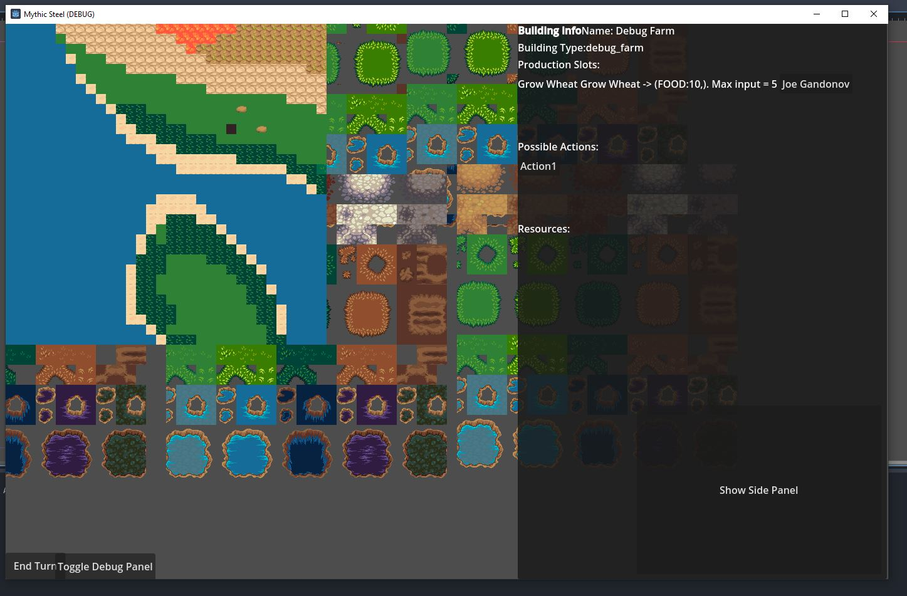
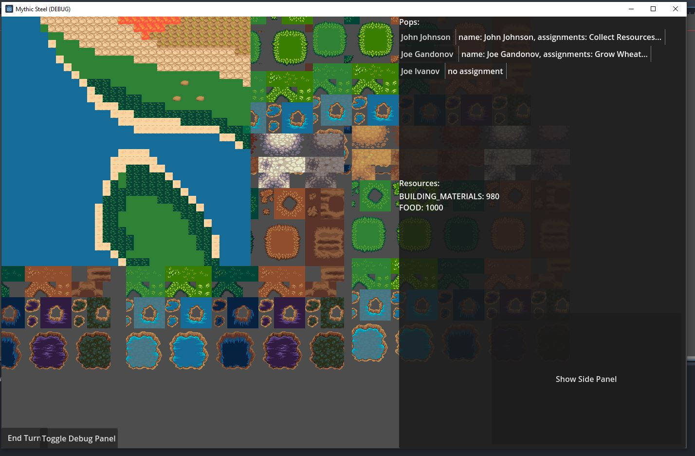

# Mythic Steel

A turn-based, top-down colony simulation inspired by RimWorld and Sid Meier's Colonization. Players strategically build and manage a thriving settlement, assigning diverse colonists to jobs, handling resource production, transportation, and navigating economic trade pressures from an overseeing authority.

## Features

- **Strategic Colony Management**: Construct various buildings, assign colonists, and carefully manage production chains.
- **Diverse Colonists**: Multiple races with distinct traits (e.g., dwarfs excel at mining, giants handle heavy labor efficiently).
- **Resource Economy**: Produce, process, and transport resources strategically to sustain and grow your colony.
- **Dynamic Trade**: Fulfill quotas and trade surplus resources, balancing internal growth with external economic demands.

## Tech Stack

- **Engine**: Godot
- **Programming Language**: GDScript
- **Art Style**: 2D top-down strategy

## Current Status

Currently in early development (alpha). The project is actively evolving, and we're seeking collaborators to expand our vision.

## Collaborators Wanted!
We're looking for enthusiastic individuals interested in contributing to this hobby project:
- UX/UI Designers
- 2D Artists
- Game Designers
- Godot Programmers

Experience is welcome but not required—enthusiasm and a willingness to collaborate are the primary criteria.

## Contribution

Feel free to fork this repository and submit pull requests. If you're interested in joining our team or discussing contributions, please reach out!

## License

MIT License
