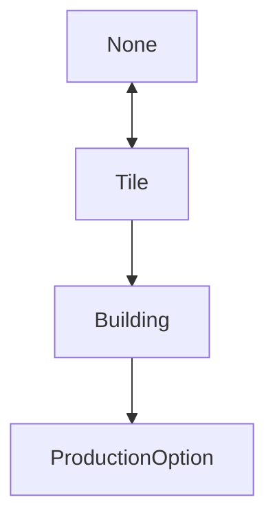

When user clicks on tile, the selector changes. There are multiple types of selectors
- None (empty)
	- Nothing is selected, nothing to highlight
- Tile
	- Tile is selected. Highlight tile and show it's info
- Building
- Production Option (of building)
## Selector types transitions:

